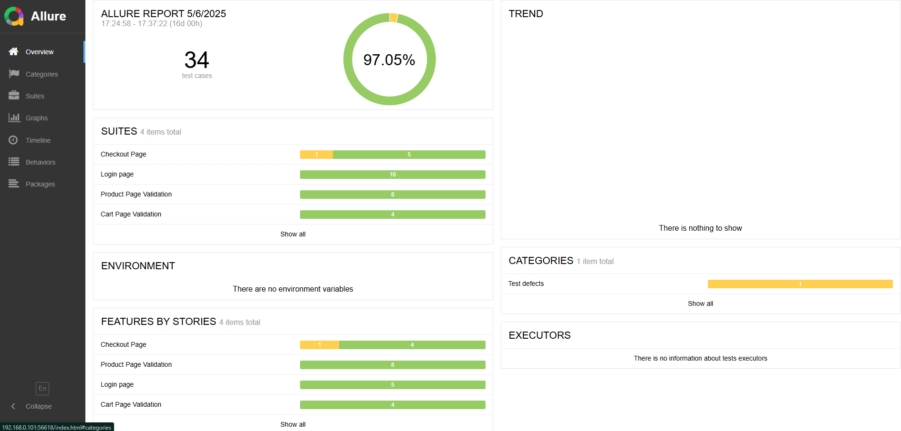
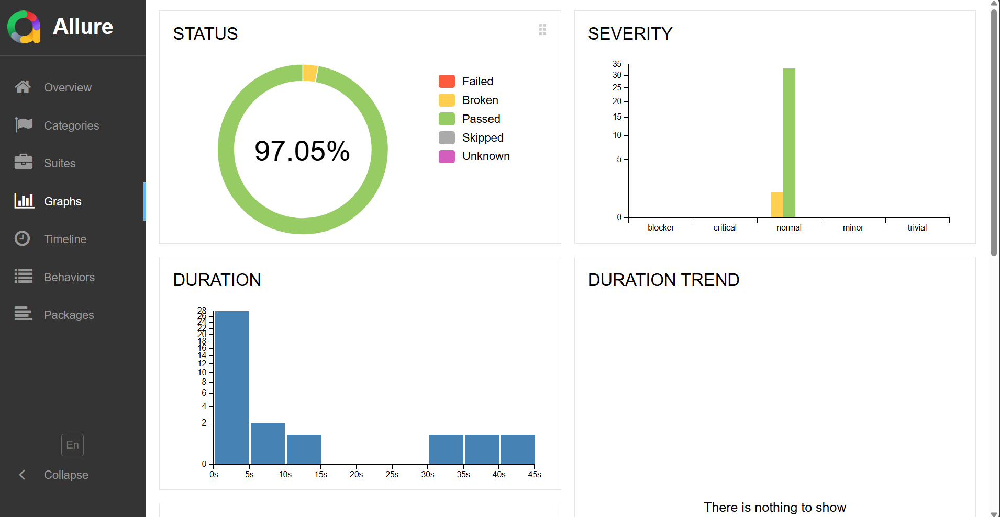
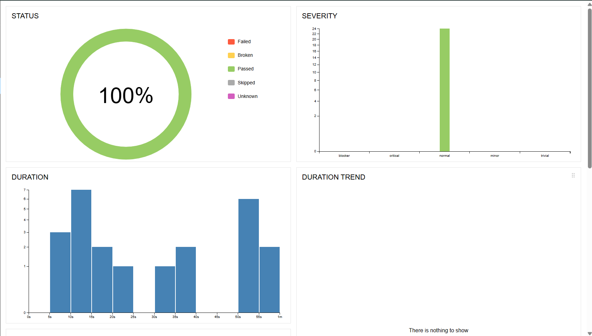

# Swag-Lab-Automation-Cucumber-Java-POM
## 🚀 Overview
This project is a **Cucumber-based automation framework** using **Selenium and TestNG** for web testing.

### Website : https://www.saucedemo.com
## 🛠️ Tech Stack
- **Cucumber** (v7.2.3)
- **Selenium WebDriver** (v4.17.0)
- **TestNG** (v7.8.0)
- **Allure Reporting** (v2.24.0)

### Page Object Model Structure
```
CucumberProject/
│
├── src/
│   └── test/
│       └── java/
│           ├── Features/                           
│           │   ├── Cart.feature
│           │   ├── Checkout.feature
│           │   ├── LoginPage.feature
│           │   └── Product.feature
│           │
│           ├── Pages/                            
│           │   ├── BasePage.java
│           │   ├── LoginPage.java
│           │   ├── ProductPage.java
│           │   ├── CartPage.java
│           │   ├── CheckOut_complete.java
│           │   ├── checkout_step_1.java
│           │   └── checkout_step_2.java
│           │
│           ├── StepDefs/                        
│           │   ├── Hooks.java
│           │   ├── LoginPageDefs.java
│           │   ├── ProductPageDefs.java
│           │   ├── CartPageDefs.java
│           │   └── CheckoutPageDefs.java
│           │
│           ├── TestRunner/                         
│           │   └── TestRunner.java
│           │
│           └── Utilities/                         
│               └── DriverSetup.java
│
├── pom.xml                                        
└── README.md                                    
```                                    


### Login feature:
```gherkin
Feature: Login page
  Background:
    Given User on the login page

  @ui
  Scenario: UI validation
    Then Username field should present
    And Username placeholder should be "Username"
    And Username field should be writable
    And Password field should present
    And Password field placeholder should be "Password"
    And Password field should be writable
    And Login button should present


  @ui
  Scenario: Login button validation
    Then Login button label should be "Login"
    And Login button color should be "rgba(61, 220, 145, 1)"
    And Login button height should be "49"
    And Login button width should be "292"
    And Login button type is "submit"

  Scenario Outline: Login with valid credentials
    When User enter <username> in the username field
    And User enter <password> in the password field
    And User click on the login button
    Then Page url should be "https://www.saucedemo.com/inventory.html"
    And User should see the cart on the page
    Examples:
      | username                  | password       |
      | "standard_user"           | "secret_sauce" |
      | "problem_user"            | "secret_sauce" |
      | "performance_glitch_user" | "secret_sauce" |
      | "error_user"              | "secret_sauce" |
      | "visual_user"             | "secret_sauce" |

  Scenario Outline: Login with invalid credentials
    When User enter <username> in the username field
    And User enter <password> in the password field
    And User click on the login button
    Then User should see the <errorMgs> in the login page
    Examples:
      | username          | password       | errorMgs                                                                    |
      | "standard_user"   | "invalidPass"  | "Epic sadface: Username and password do not match any user in this service" |
      | "standard_user"   | ""             | "Epic sadface: Password is required"                                        |
      | ""                | "secret_sauce" | "Epic sadface: Username is required"                                        |
      | ""                | "invalidPass"  | "Epic sadface: Username is required"                                        |
      | ""                | ""             | "Epic sadface: Username is required"                                        |
      | "invaliduser"     | "secret_sauce" | "Epic sadface: Username and password do not match any user in this service" |
      | "invaliduser"     | ""             | "Epic sadface: Password is required"                                        |
      | "locked_out_user" | "secret_sauce" | "Epic sadface: Sorry, this user has been locked out."                       |

  Scenario: Checking error message remove button
    When User enter "standard_user" in the username field
    And User enter "invalidPass" in the password field
    And User click on the login button
    Then User should see the "Epic sadface: Username and password do not match any user in this service" in the login page
    And User click on the remove button
    Then The error message should disappear
    But Username and password should not be removed from the respective fields
```

### Product feature:
```gherkin
Feature: Product Page Validation
  Background:
    Given User on the login page
    And User enter "standard_user" in the username field
    And User enter "secret_sauce" in the password field
    And User click on the login button
    
  @ui
  Scenario: UI Validation
    Then Product page header should be "Swag Labs"
    And Page title should be "Swag Labs"
    And Current url should be "https://www.saucedemo.com/inventory.html"
    And Menu bar should be displayed
    And Menu bar should be clickable
    And Cart should be displayed
    And Cart should be clickable
    And All products should be displayed

  Scenario: Adding products to the cart
    When User add first product to the cart
    Then The digit "1" should be visible on the cart logo
    And User add second product to the cart
    Then The digit "2" should be visible on the cart logo


  Scenario: Adding and removing items from cart
    When User add first product to the cart
    Then The digit "1" should be visible on the cart logo
    And User add second product to the cart
    Then The digit "2" should be visible on the cart logo
    And User remove first product from the cart
    Then The digit "1" should be visible on the cart logo

  Scenario: Product sort option should be selected A to Z by default
    Then Product sort option should be selected "Name (A to Z)"


  Scenario: Validate all products are shown in Descending order when select Name (Z to A)
    When User select "Name (Z to A)" from the sort products
    Then User should see all products in descending order according to product name

  Scenario: Validate all products are shown in Ascending order when select Name (A to Z)
    When User select "Name (A to Z)" from the sort products
    Then User should see all products in ascending order according to product name

  Scenario: Validate all products are shown in Descending order when select Price (low to high)
    When User select "Price (low to high)" from the sort products
    Then User should see all products in low to high price order

  Scenario: Validate all products are shown in Descending order when select Price (high to low)
    When User select "Price (high to low)" from the sort products
    Then User should see all products in high to low price order
```
### Report:



